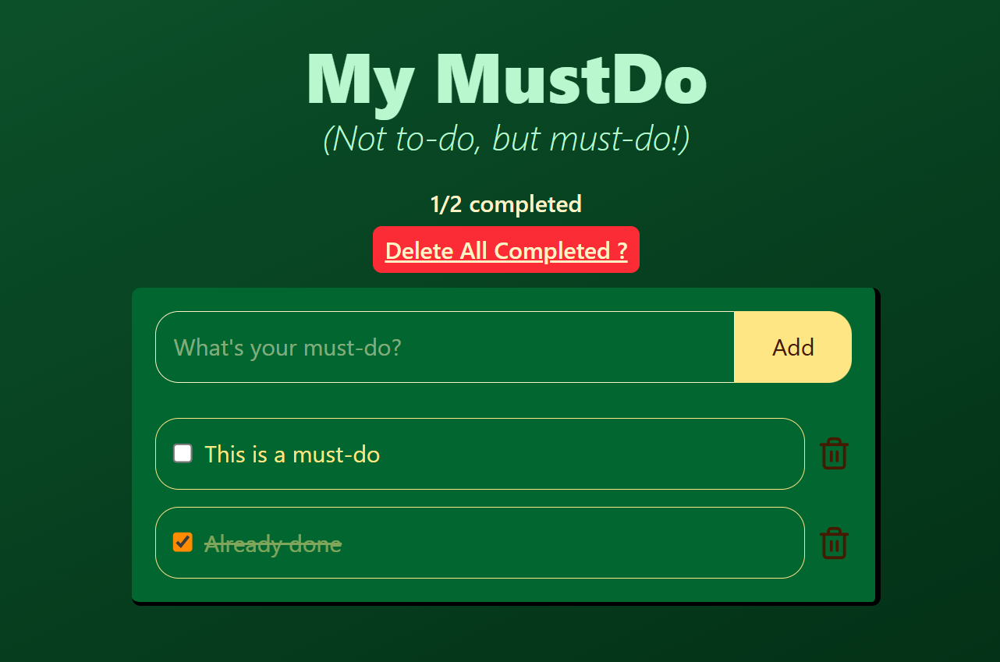

<h1 align="center">MustDo</h1>

<p align="center">
  <strong>My MustDo App</strong> – Not to-do, but must-do! Simple React + TypeScript + Tailwind todo app with localStorage persistence.
</p>

---

<!-- Badges -->
<p align="center">
  
  
  
  
  
</p>

---

## 📖 Project Description

MustDo is a **lightweight and simple todo app** built with **React**, **TypeScript**, **Vite**, and **Tailwind CSS**.  
It allows you to:

- Create, read, and delete MustDo items
- Mark tasks as completed
- Automatically save tasks in localStorage for persistence

Perfect for learning modern frontend stack while building a useful daily task tracker.

---

## 🎬 Demo

### Screenshot
<p align="center">
  
</p>

---

## 🚀 Get Started

```bash
npm install
npm run dev
```